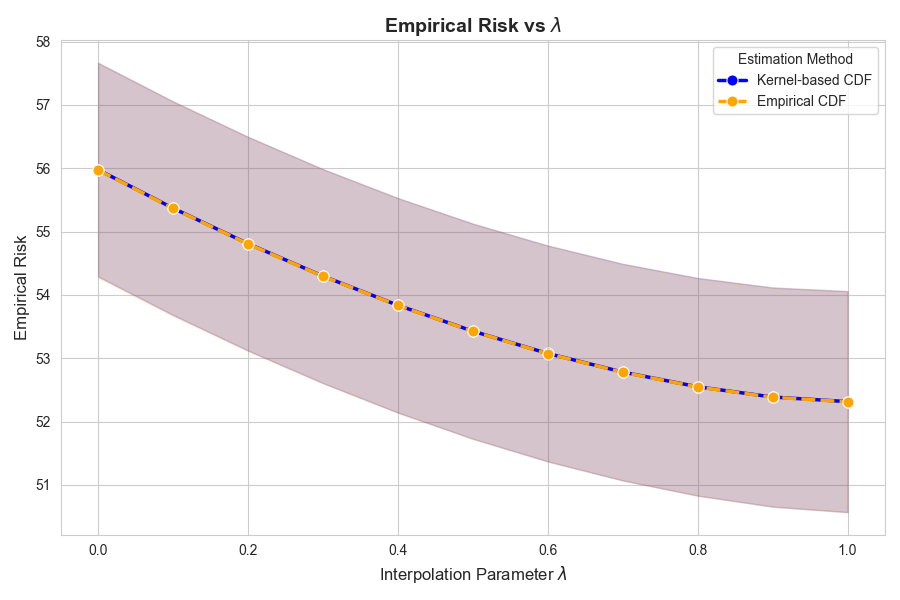
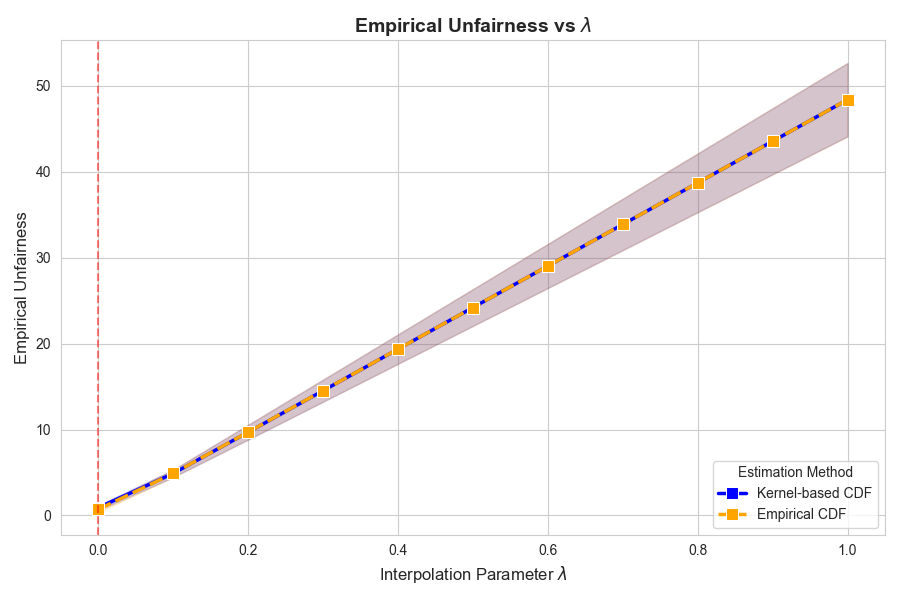
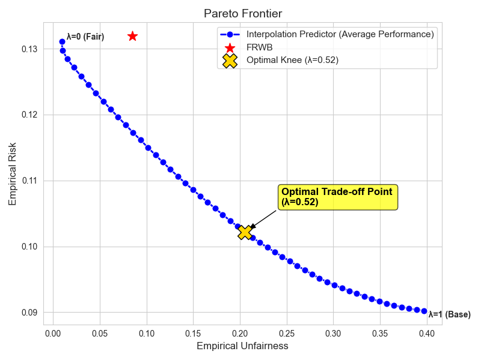
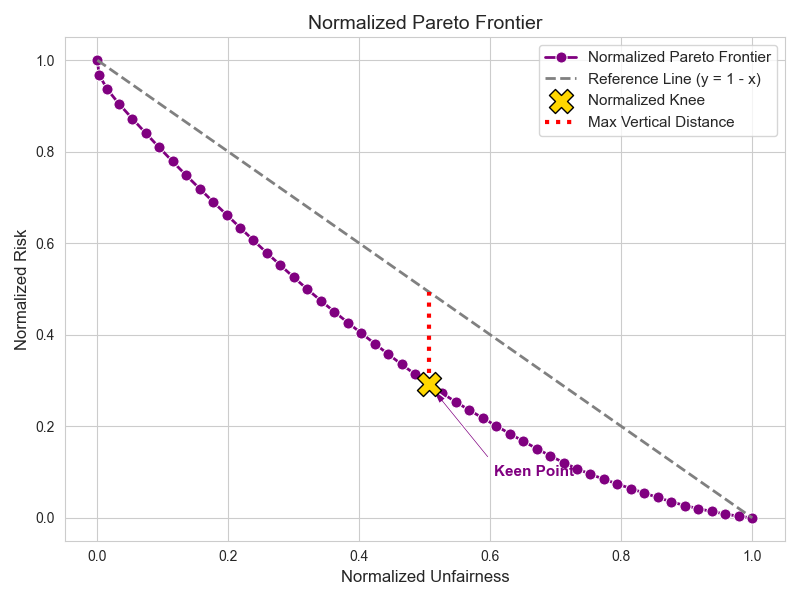
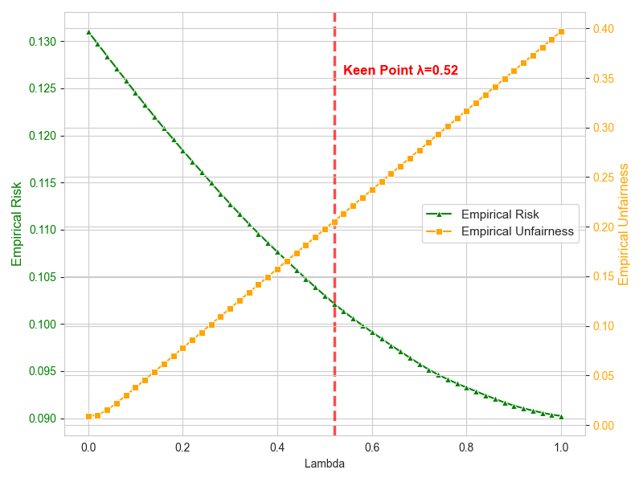
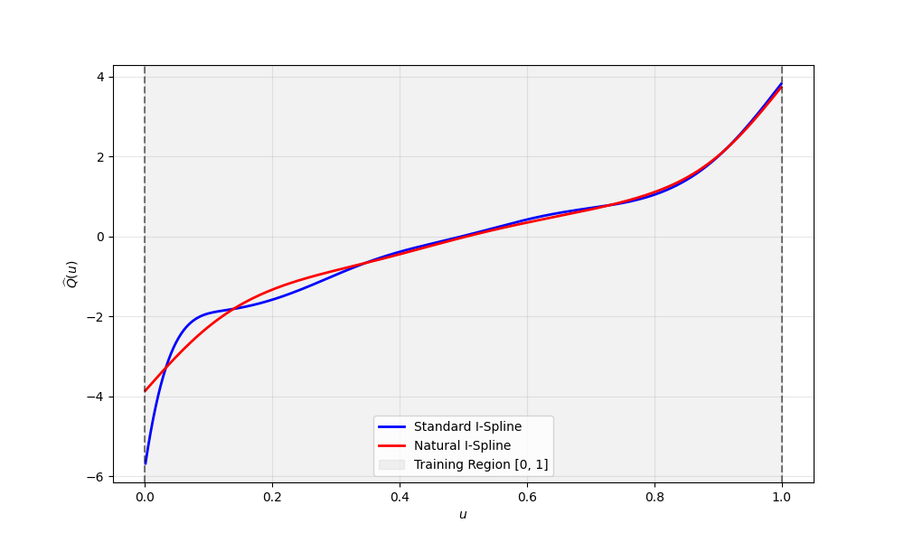
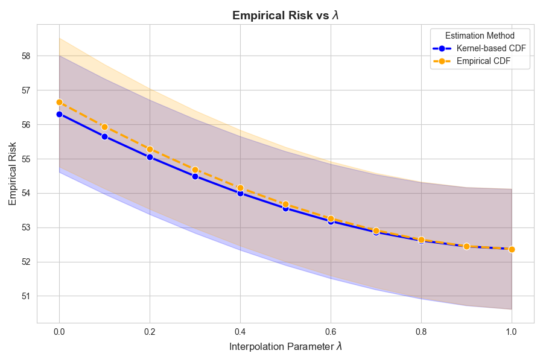
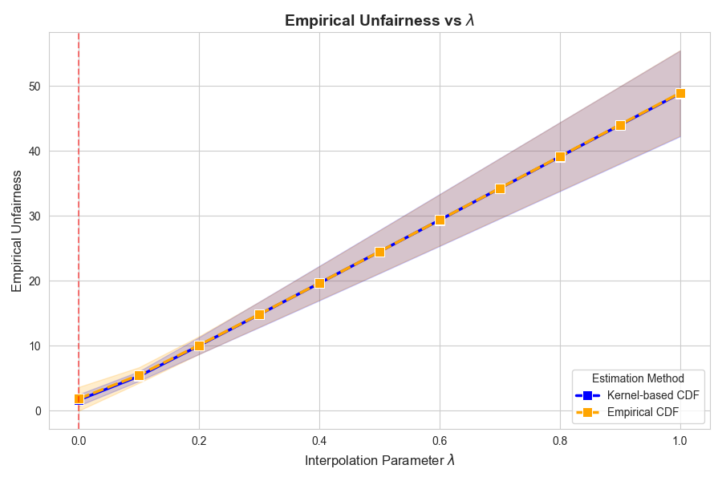

## Figure 1. 
 |  |
| :---: | :---: |
| (a) Empirical risk versus $\lambda$ | (b) Empirical unfairness versus $\lambda$ |

> **Figure 1:** Performance evaluation over 100 independent trials under the Huber loss ($\zeta=1.345$).  
> **(a)** Empirical risk as a function of the interpolation hyper-parameter $\lambda$. This plot validates that for small $\lambda$, our kernel-based approach achieves lower empirical risk and significantly reduces the variance compared to the standard empirical CDF-based method.  
> **(b)** Empirical unfairness versus $\lambda$. The results demonstrate that the kernel-based approach also significantly reduces the variance of the unfairness level compared to the standard empirical CDF-based method for small interpolation parameters.

---

  

## Figure 2. 

|  |  |  |
| :---: | :---: | :---: |
| (a) Pareto Frontier | (b) Normalized Pareto Frontier | (c) Metrics versus $\lambda$ |

> **Figure 2:** Empirical risk (LAD) and unfairness across various interpolation parameters $\lambda$ under real CRIME data.  
> **(a)** The empirical trade-off between predictive risk and unfairness. The yellow marker indicates the optimal knee point ($\lambda=0.52$) identified by the Kneedle algorithm, representing the most cost-effective operating point for real-world deployment.  
> **(b)** The underlying mathematical mechanism for the optimal $\lambda$ selection. By mapping the frontier into a $[0,1]$ normalized space, the Kneedle algorithm rigorously identifies the equilibrium point that maximizes the vertical distance to the reference chord.  
> **(c)** Empirical verification of Theorems 3.5 and 3.6. As $\lambda$ increases, the unfairness scales strictly linearly while the empirical risk decreases monotonically. The red dashed line marks the optimal knee point.

---

## Figure3. 

> **Figure:** Comparison of the estimated transformation $\widehat{Q}(u)$ using Standard I-Spline and Natural I-Spline. The Natural I-Spline restricts the second-order derivatives at the boundaries, resulting in a smoother estimation near $u=0$ and $u=1$.

---

## Figure4. 

|  |  |
| :---: | :---: |
| (a) Empirical risk versus $\lambda$ | (b) Empirical unfairness versus $\lambda$ |

> **Figure:** Performance evaluation over 100 independent trials under the Huber loss ($\zeta=1.345$). For the kernel-based CDF approach, we utilize the Wang-van Ryzin kernel to estimate the conditional CDF before obtaining our final predictor.  
> **(a)** Empirical risk as a function of the interpolation hyper-parameter $\lambda$. This plot validates that for small $\lambda$, our kernel-based approach achieves lower empirical risk and significantly reduces the variance compared to the standard empirical CDF-based method.  
> **(b)** Empirical unfairness versus $\lambda$. The results demonstrate that the kernel-based approach also significantly reduces the variance of the unfairness level compared to the standard empirical CDF-based method for small interpolation parameters.

---
**Table 1:** Performance Comparison of Empirical and Kernel-based CDF Estimators under Huber Loss (100 Trials); The degree of unfairness for predictor $f$ is defined as the maximal Wasserstein-1 distance of conditional distribution $f(\boldsymbol{X}, S)$ between any pair of sensitive groups.

| Estimator | Empirical Risk (Mean) | Empirical Risk (Std. Dev.) | Empirical Unfairness (Mean) | Empirical Unfairness (Std. Dev.) |
| :--- | :---: | :---: | :---: | :---: |
| RDNN | 52.3129 | 1.7436 | 48.4064 | 4.2938 |
| FRWB | 57.0495 | 1.7684 | 1.5583 | 0.7503 |
| Ours with Empirical CDF | **55.9728** | 1.6930 | **0.7031** | 0.3334 |
| Ours with Kernel CDF | 55.9782 | **1.6860** | 0.8982 | **0.2793** |
---

**Table 2:** The runtime (in seconds) with varying sample sizes $(n)$ and numbers of I-spline basis functions ($J _{n}$).

| $n \setminus J _{n}$ | 6 | 9 | 12 | 15 | 18 | 23 | 28 |
| :--- | :--- | :--- | :--- | :--- | :--- | :--- | :--- |
| 500 | 0.0480 | 0.0960 | 0.2734 | 0.4559 | 0.8092 | 1.1964 | 0.5196 |
| 1000 | 0.0640 | 0.4188 | 0.3572 | 0.7667 | 0.3001 | 0.3851 | 0.8987 |
| 2000 | 0.1901 | 0.1685 | 1.3640 | 1.5791 | 0.3782 | 1.0496 | 2.6441 |
| 5000 | 0.2721 | 0.2382 | 1.8678 | 2.4900 | 2.6850 | 0.4334 | 3.6759 |
| 10000 | 0.3334 | 1.0428 | 1.9577 | 4.5505 | 3.2013 | 5.4520 | 5.4429 |
| 20000 | 0.5125 | 1.8884 | 4.3074 | 7.1253 | 9.2683 | 4.7845 | 9.6148 |

---

**Table 3:** Performance comparison of FRWB, Standard I-Spline and Natural I-Spline (100 Trials); The degree of unfairness for predictor $f$ is defined as the maximal Wasserstein-1 distance of conditional distribution $f(\boldsymbol{X}, S)$ between any pair of sensitive groups.

| Method | Empirical Risk (Mean) | Empirical Risk (Std. Dev.) | Empirical Unfairness (Mean) | Empirical Unfairness (Std. Dev.) |
| :--- | :---: | :---: | :---: | :---: |
| FRWB (Baseline) | 3.9541 | 1.6514 | 0.0124 | 0.0016 |
| Natural I-Spline | 3.8872 | 1.6528 | **0.0040** | **0.0009** |
| Standard I-Spline | **3.8762** | **1.6519** | 0.0049 | 0.0012 |

**Table 4:** Performance Comparison of Empirical and Kernel-based CDF Estimators under Huber Loss with 100 trials; The degree of unfairness for predictor $f$ is defined as the maximal Wasserstein-1 distance of conditional distribution $f(\boldsymbol{X}, S)$ between any pair of sensitive groups..

| Estimator | Empirical Risk (Mean) | Empirical Risk (Std. Dev.) | Empirical Unfairness (Mean) | Empirical Unfairness (Std. Dev.) |
| :--- | :---: | :---: | :---: | :---: |
| Ours with Empirical CDF | 56.6451 | 1.8764 | 1.8371 | 1.8223 |
| Ours with Kernel CDF | **56.3099** | **1.7002** | **1.6539** | **0.8690** |
