## Figure 1. 
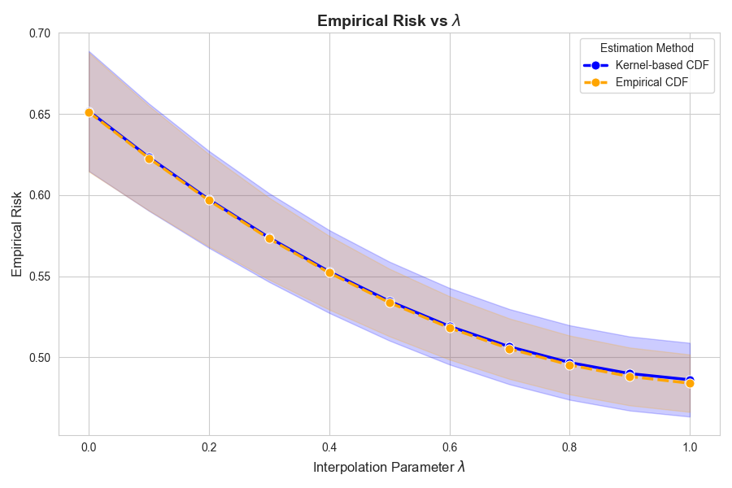 | 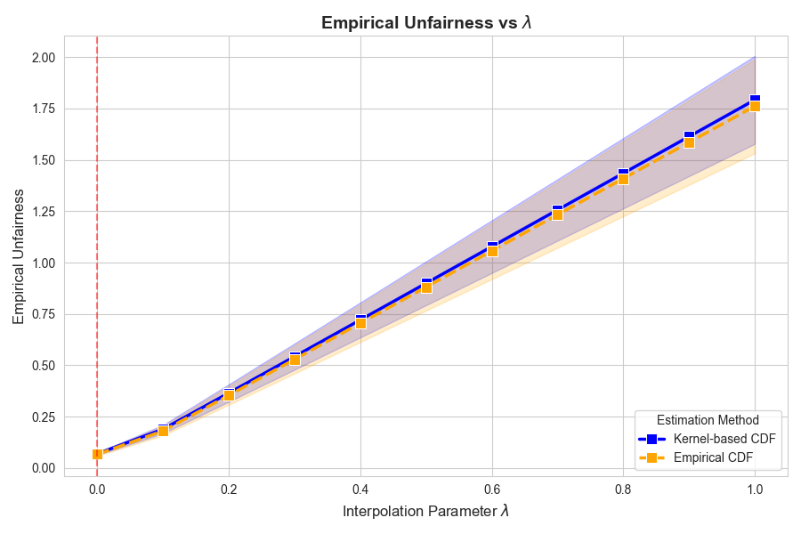 |
| :---: | :---: |
| (a) Empirical risk versus $\lambda$ | (b) Empirical unfairness versus $\lambda$ |

> **Figure 1:** Performance evaluation over 200 independent trials under the Huber loss ($\zeta=1.345$).  
> **(a)** Empirical risk as a function of the interpolation hyper-parameter $\lambda$. This plot validates that for small $\lambda$, our kernel-based approach achieves lower empirical risk and significantly reduces the variance compared to the standard empirical CDF-based method.  
> **(b)** Empirical unfairness versus $\lambda$. The results demonstrate that the kernel-based approach also significantly reduces the variance of the unfairness level compared to the standard empirical CDF-based method for small interpolation parameters.

---

  

## Figure 2. 

| 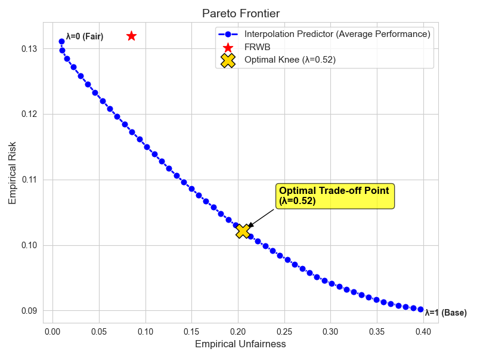 | 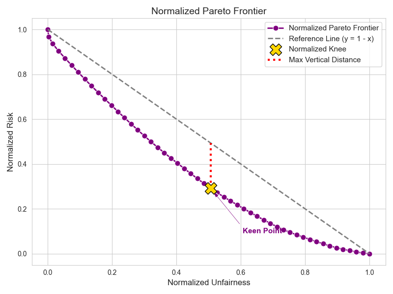 | 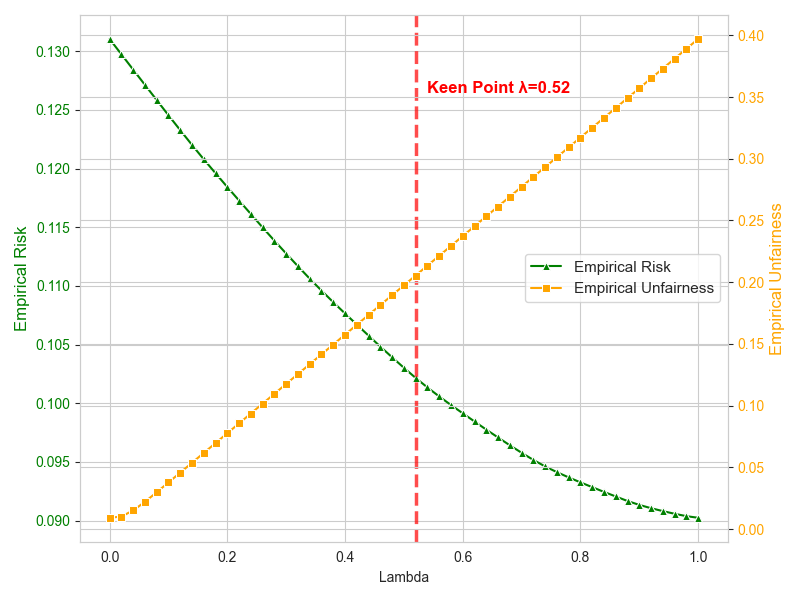 |
| :---: | :---: | :---: |
| (a) Pareto Frontier | (b) Normalized Pareto Frontier | (c) Metrics versus $\lambda$ |

> **Figure 2:** Empirical risk (LAD) and unfairness across various interpolation parameters $\lambda$ under real CRIME data.  
> **(a)** The empirical trade-off between predictive risk and unfairness. The yellow marker indicates the optimal knee point ($\lambda=0.52$) identified by the Kneedle algorithm, representing the most cost-effective operating point for real-world deployment.  
> **(b)** The underlying mathematical mechanism for the optimal $\lambda$ selection. By mapping the frontier into a $[0,1]$ normalized space, the Kneedle algorithm rigorously identifies the equilibrium point that maximizes the vertical distance to the reference chord.  
> **(c)** Empirical verification of Theorems 3.5 and 3.6. As $\lambda$ increases, the unfairness scales strictly linearly while the empirical risk decreases monotonically. The red dashed line marks the optimal knee point.

---

## Figure 3. 

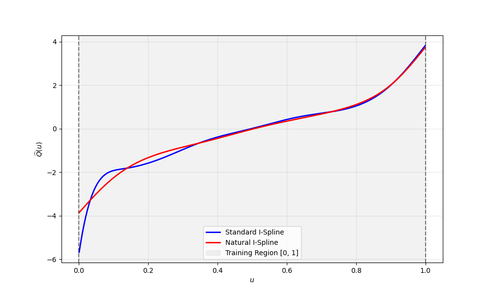

> **Figure 3:** Comparison of the estimated transformation $\widehat{Q}(u)$ using Standard I-Spline and Natural I-Spline. The Natural I-Spline restricts the second-order derivatives at the boundaries, resulting in a smoother estimation near $u=0$ and $u=1$.

---
## Figure 4.

| 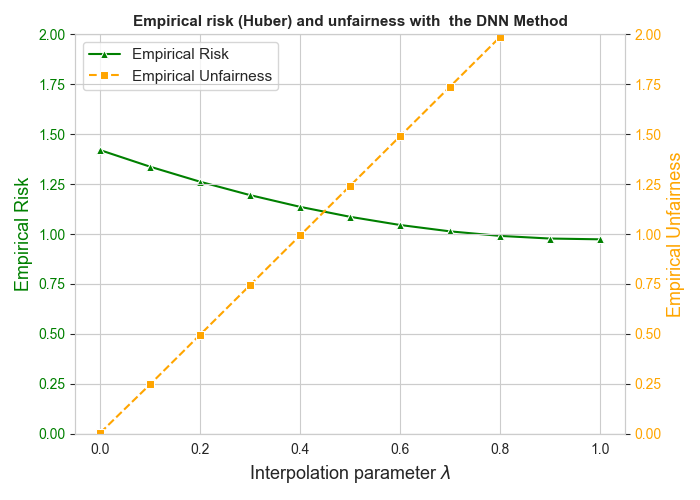 | 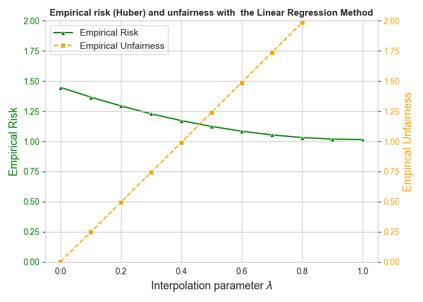 |
| :---: | :---: |
| (a) DNN | (b) Linear Regression |
| 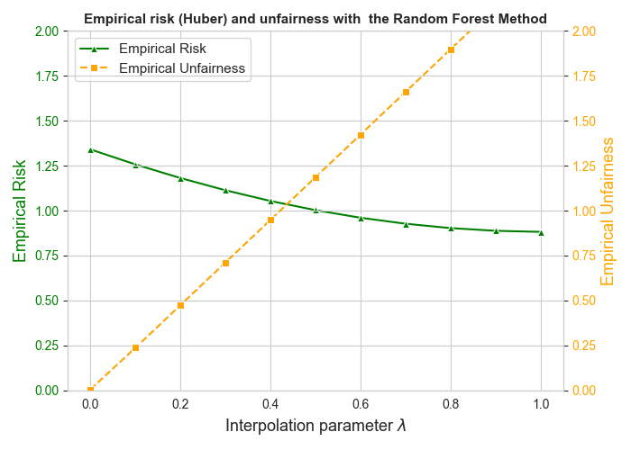 | 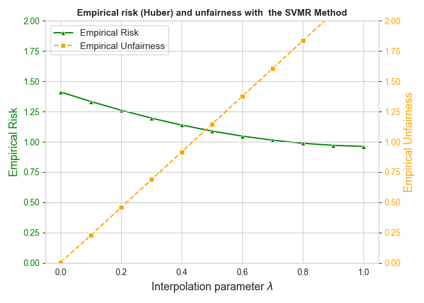 |
| (c) Random Forest | (d) SVMR |

> **Figure 4:** Empirical verification of the impact of interpolation parameter $\lambda$ for different base models. As $\lambda$ increases from $0$ to $1$, the empirical unfairness scales linearly while the empirical risk decreases monotonically.

---

## Figure 5.

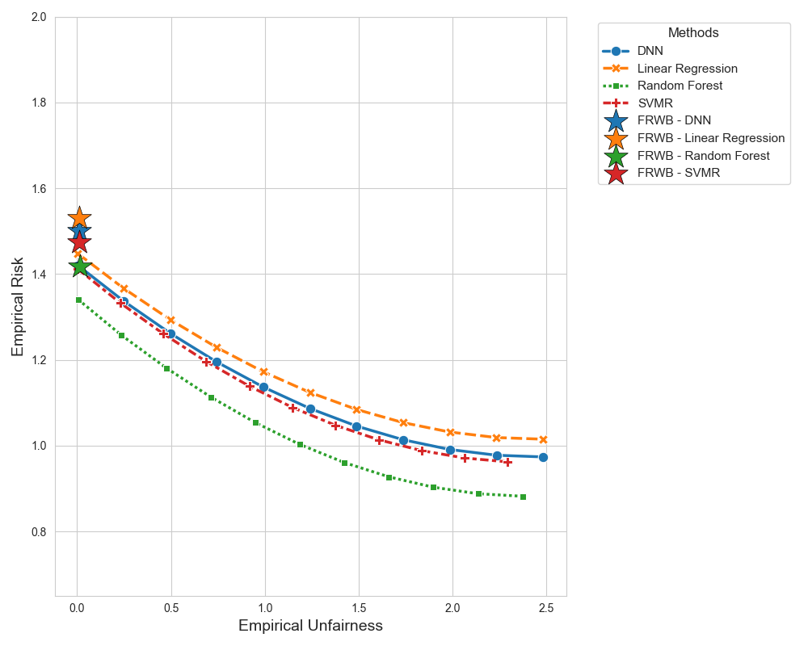

> **Figure 5:** Trade-off plot between empirical risk (Huber) and unfairness varying with the interpolation hyper-parameter $\lambda$ across different base methods in the simulation study (see Section 6.1).
---
**Table 1:** Performance Comparison of Empirical and Kernel-based CDF Estimators under Huber Loss (200 Trials) with empirical risk  $\mathcal{R}_N(f; L)$ and unfairness $\mathcal{U}_N(f)$; The degree of unfairness   for predictor $f$ is defined as the maximal Wasserstein-1 distance of conditional distribution $f(\boldsymbol{X}, S)$ between any pair of sensitive groups.

| Estimator | Empirical Risk  (Mean) | Empirical Risk  (Std. Dev.) | Empirical Unfairness (Mean) | Empirical Unfairness  (Std. Dev.) |
| :--- | :---: | :---: | :---: | :---: |
| RDNN | 52.3129 | 1.7436 | 48.4064 | 4.2938 |
| FRWB | 57.0495 | 1.7684 | 1.5583 | 0.7503 |
| Ours with Empirical CDF | **55.9728** | 1.6930 | **0.7031** | 0.3334 |
| Ours with Kernel CDF | 55.9782 | **1.6860** | 0.8982 | **0.2793** |
---

### **Table 2:** The mean and standard deviation of runtime (in seconds) over 30 repeats with varying sample sizes ($n$) and numbers of I-spline basis functions ($J_n$).

| $n \setminus J_n$ | 6 | 9 | 12 | 15 | 18 | 23 | 28 |
| :--- | :--- | :--- | :--- | :--- | :--- | :--- | :--- |
| **500** | 0.022 (0.001) | 0.042 (0.001) | 0.055 (0.001) | 0.072 (0.002) | 0.200 (0.008) | 0.330 (0.010) | 0.297 (0.010) |
| **1000** | 0.030 (0.016) | 0.086 (0.004) | 0.217 (0.007) | 0.098 (0.004) | 0.270 (0.009) | 0.344 (0.016) | 0.393 (0.016) |
| **2000** | 0.057 (0.001) | 0.154 (0.004) | 0.306 (0.004) | 0.221 (0.002) | 0.146 (0.013) | 0.672 (0.013) | 0.214 (0.007) |
| **5000** | 0.084 (0.009) | 0.132 (0.006) | 0.287 (0.007) | 0.447 (0.010) | 0.374 (0.009) | 0.438 (0.013) | 0.861 (0.014) |
| **10000** | 0.078 (0.003) | 0.221 (0.004) | 0.352 (0.010) | 0.463 (0.017) | 0.753 (0.016) | 0.705 (0.014) | 1.284 (0.029) |
| **20000** | 0.128 (0.006) | 0.237 (0.005) | 0.456 (0.004) | 0.774 (0.019) | 0.978 (0.031) | 0.989 (0.036) | 2.020 (0.065) |

---

**Table 3:** Performance comparison of FRWB, Standard I-Spline and Natural I-Spline (100 Trials); The degree of unfairness for predictor $f$ is defined as the maximal Wasserstein-1 distance of conditional distribution $f(\boldsymbol{X}, S)$ between any pair of sensitive groups.

| Method | Empirical Risk (Mean) | Empirical Risk (Std. Dev.) | Empirical Unfairness (Mean) | Empirical Unfairness (Std. Dev.) |
| :--- | :---: | :---: | :---: | :---: |
| FRWB (Baseline) | 3.9541 | 1.6514 | 0.0124 | 0.0016 |
| Natural I-Spline | 3.8872 | 1.6528 | **0.0040** | **0.0009** |
| Standard I-Spline | **3.8762** | **1.6519** | 0.0049 | 0.0012 |

---

**Table 4:** Sample means and standard deviations of empirical risk and unfairness for unconstrained predictors across various base models, and the corresponding fair predictors obtained via the proposed transformation, over 200 independent trials.

| Base Model | Unconstrained Risk (Mean) | Unconstrained Risk (Std) | Unconstrained Unfairness (Mean) | Unconstrained Unfairness (Std) | Fair Risk (Mean) | Fair Risk (Std) | Fair Unfairness (Mean) | Fair Unfairness (Std) |
| :--- | :---: | :---: | :---: | :---: | :---: | :---: | :---: | :---: |
| DNN | 0.9735 | 0.0530 | 2.4817 | 0.1599 | 1.4202 | 0.0769 | 0.0050 | 0.0010 |
| Linear regression | 1.0148 | 0.0524 | 2.4806 | 0.1507 | 1.4473 | 0.0760 | **0.0049** | **0.0009** |
| Random forest | **0.8818** | **0.0497** | 2.3719 | 0.1895 | **1.3405** | 0.0770 | 0.0057 | 0.0011 |
| Support vector regression | 0.9620 | 0.0537 | **2.2937** | **0.1605** | 1.4115 | 0.0793 | **0.0049** | **0.0009** |

